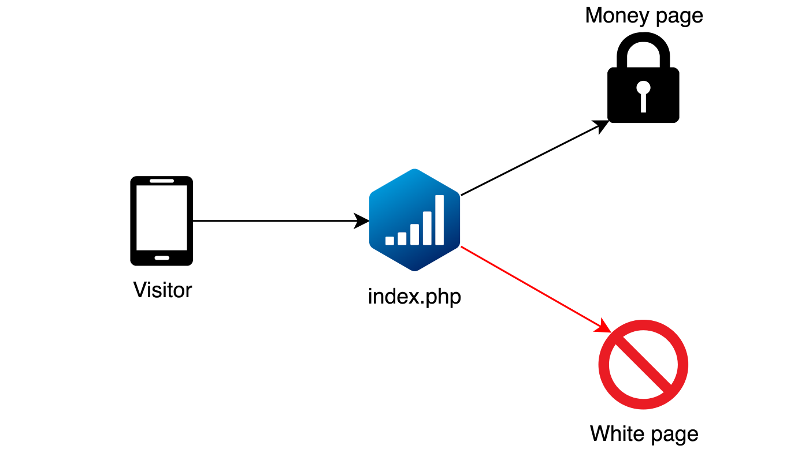

# Integration

After creating a stream you will be immediately brought to the integration page.
Adspect supports several types of integration that differ in technical details and use cases:

* Forward PHP integration via a standalone `index.php` file
* Reverse PHP integration via including a `filter.php` file
* JavaScript integration via `<script>` HTML tag embedding using a remote `ajax.php` file

## __sid

Each stream has its own `index.php`, `filter.php`, and `ajax.php` files wired to it that have the stream ID encoded inside.
However, you may override that encoded stream ID and send a click to a different stream by putting the destination
full stream ID into the `__sid` URL parameter, e.g:

```
https://example.com/index.php?__sid=1ea85c7c-b977-6804-8e69-00162501c2b4
```

You may find stream ID next to its name in the streams list.

If you need use a different parameter name instead of `__sid`, then open Adspect PHP file in a text editor and replace
the `__sid` string with the desired name (e.g. `utm_campaign`.)

## PHP Integration

PHP integration comes in two flavors: forward and reverse. They differ only in how our PHP files are wired with your
*locally hosted* landing pages, i.e. which file receives incoming traffic.

Both integration types support several methods for displaying links to external sites, that is, money and white pages
specified as URLs in stream settings:

* HTTP redirect -- regular redirection to the remote URL via HTTP 302 status code. This is the usual choice in most cases.
  **If you don't know which display method to choose, then go with HTTP redirect.**

* HTML iframe -- display the remote URL on your domain inside an `<iframe>` tag. Please note that websites may forbid
  displaying their content inside an [iframe](https://en.wikipedia.org/wiki/HTML_element#Frames) by using the
  [X-Frame-Options](https://developer.mozilla.org/en-US/docs/Web/HTTP/Headers/X-Frame-Options) response header.

* Reverse proxy -- display the remote URL on your domain by [HTTP request proxying](https://en.wikipedia.org/wiki/Reverse_proxy).
  This method also suffers from several technical complications and should be used only if no other method fits.

## Forward PHP Integration

In forward PHP integration filtering is done by a special `index.php` file that you place in your landing page directory
or elsewhere accessible via HTTP. This file acts as an entry point for web traffic and is wired to our servers that
process clicks and make decisions.



After uploading the `index.php` file to your hosting its URL will be the cloaked URL suitable for use in advertising campaigns.
Several copies of the same `index.php` file may be used for protecting several offers or landing pages without interfering
with each other except for shared statistics.

Forward PHP integration is the most common type of integration. **If you don't know which integration type to choose, then
go with forward PHP integration.**

## Reverse PHP Integration

There's also a slightly different reverse PHP integration that uses a `filter.php` file which is included into your
PHP page file (normally your white page) via a single line of PHP code. Traffic lands directly on this page, our code
in the `filter.php` file inspects it and chooses either to keep the visitor on the page or display a different one.


In order to perform reverse PHP integration you first need to download the `filter.php` file on the Reverse PHP Integration
tab and put it into the folder of your site or landing page. Several copies of the same `filter.php` file may be used for
protecting several sites or landing pages without interfering with each other except for shared statistics.

Then add the following code as **the first line** of your site or landing page index file (usually named `index.php`)
above all other code:

```php
<?php require __DIR__ . '/filter.php' ?>
```

If your site is written in pure HTML, then you may safely rename your `index.html` or any other HTML file to `index.php` or
any other name ending in `.php` before adding the code to it.

If you added the code into your white page, then leave the White Page field empty in the stream settings. Empty field means
"no action", i.e. Adspect will not take any action, leaving the visitor on their current page which is the white page.
Likewise, if you added the code into your money page, then leave the Money Page field of your stream empty.

Once set up, you then simply direct traffic to the page you added the code into.

### WordPress and Other CMS

Reverse PHP integration is useful for integrating Adspect into sites based on WordPress or similar CMS
([content management systems](https://en.wikipedia.org/wiki/Content_management_system).)

WordPress has a file named `index.php` in its [root folder](https://www.wpbeginner.com/beginners-guide/beginners-guide-to-wordpress-file-and-directory-structure/).
That is the file where you should add that single line of PHP code discussed above. Place the `filter.php` file into the same folder.

Most other PHP-based CMS software also has such `index.php` entryway files in their root folders.
**When using reverse PHP integration with WordPress, please note that the "White page" link should be empty, because of the CMS permalink structre.

## JavaScript integration

JavaScript integration is meant to be used with third party services like Shopify, Blogspot, or Tilda, where you cannot
upload custom PHP files to do PHP integration. Traffic flow is much like in reverse PHP integration: visitors come to
the white page first, then legitimate ones are displayed the money page whereas moderators and bots are left where they are.


You will also need to download a PHP file called `ajax.php` and host it somewhere, but its final location does not
matter as it will be linked into the white page using a `<script>` HTML tag.

**It is important** to link `ajax.php` via HTTPS if the website you are integrating Adspect into also uses HTTPS (which is
almost always the case.) Trying to link `ajax.php` to an HTTPS site via plain HTTP will result in
[mixed content](https://developer.mozilla.org/en-US/docs/Web/Security/Mixed_content) error in most modern browsers,
and cloaking will not work.

Like PHP integration, JavaScript integration also supports several modes of operation:

* In JavaScript redirect mode, legitimate visitors as determined by our filters will be directed to the money page
  via JavaScript redirect using the `location.replace()` method, i.e. the URL in the address bar will change.
  This is the usual mode. **If you don't know what to choose, then go with JavaScript redirect.**

* In iframe overlay mode, legitimate visitors will be shown the money page via an [iframe](https://en.wikipedia.org/wiki/HTML_element#Frames)
  overlay without redirecting them anywhere, i.e. the money page iframe will be placed over the white page. Please note that websites may forbid
  displaying their content inside an iframe by using the [X-Frame-Options](https://developer.mozilla.org/en-US/docs/Web/HTTP/Headers/X-Frame-Options) response header.

* In passive mode our statistics will be updated, but no further action will be taken--the visitor will remain
  on the page. This mode is like Google Analytics--perfect for collecting passive insights and blacklists of bot-ridden
  sources in cases that do not require cloaking.

Several copies of the same `ajax.php` file may be used for protecting several pages without interfering with each other
except for shared statistics.

**Please note** that white page setting is ignored in JavaScript integration because visitors initially land on the white page,
which is the page that our `<script>` tag is placed on.

## Debugging

The most often observed error is 500 Internal Server Error, which is usually caused by
either of the following misconfigurations:

1. File specified for zero redirect displaying of money/white page could not be found;
2. Your PHP installation does not have cURL support&ndash;you need to install the `php-curl` package.

All Adspect PHP files support debug mode. If enabled, any server-side errors will be displayed directly in browser window.
In order to enable debug mode you need to open our PHP file in a text editor, find the following piece of code in
the beginning of the file:

```php
<?php
 define('ADSPECT_DEBUG', 0);
```

and replace `0` with `1` in it:

```php
<?php
 define('ADSPECT_DEBUG', 1);
```

If your PHP integration does not work, e.g. you observe an HTTP 500 error, then you will see error details in
debug mode. When debugging JavaScript integration, you should navigate directly to the URL of the `ajax.php` file.
If you don't know how to fix a particular error, then please contact us in Telegram about it.

**Do not forget to disable debug mode after all errors are fixed.**
