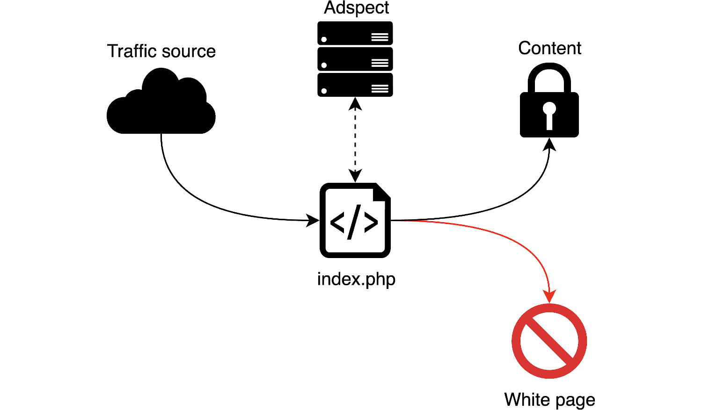
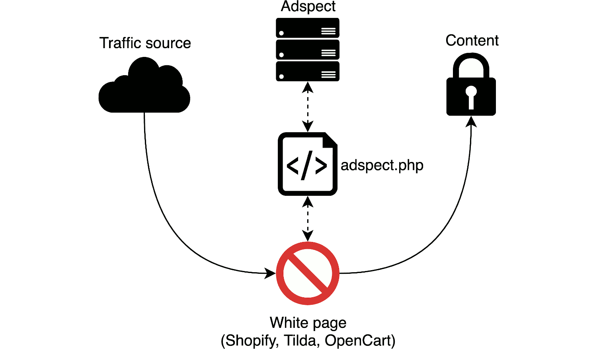

# Overview

[Adspect](https://www.adspect.ai/) is an easy-to-use cloud-based service for protecting affiliate campaigns
(CPA offers, landing pages) from "bad" traffic. By bad traffic we mean:

* [click fraud](https://en.wikipedia.org/wiki/Click_fraud), ubiquitous in display ads and popunder;
* moderators and policy teams of ad networks;
* spy services used by competitors to steal your creatives and landing pages;
* [content scrapers](https://en.wikipedia.org/wiki/Web_scraping);
* [credential stuffing bots](https://en.wikipedia.org/wiki/Credential_stuffing);
* bots of antivirus companies;
* and other flavors of unwanted or outright hostile visitors.

We work with all traffic sources, both existing and those that will appear in future--our filtering algorithms
are perfectly universal and equally efficient across all possible origins of traffic. We support all the largest
advertising networks, including:

* **Facebook and Instagram**
* **Google Ads**
* **TikTok**
* **Microsoft Advertising (Bing Ads)**
* Yandex.Direct
* myTarget
* VK
* ZeroPark
* ExoClick
* Taboola
* MGID
* PropellerAds
* TrafficStars
* **and hundreds of others**

We protect your landing pages and offers from various antivirus, security, and ad scoring companies, including:

* **GeoEdge**
* Integral Ad Science
* Google Safe Browsing
* Kaspersky Labs
* Avast
* Forcepoint
* Residential and mobile proxies, **including Luminati and GeoSurf**
* and many others

You may find additional information in our [FAQ](https://www.adspect.dev/faq).

We support several types of integration that differ in technical details but all provide equally high levels of protection:

* Forward PHP integration via standalone `index.php` file;
* Reverse PHP integration via standalone `filter.php` file;
* JavaScript integration via `<script>` HTML tag:
  * Passive mode without cloaking, like Google Analytics--perfect for collecting bot statistics;
  * Cloaking via JavaScript redirect to content page using the `location.replace()` method;
  * Cloaking via iframe overlay without redirecting.

## PHP Integration

PHP integration comes in two flavors: forward and reverse. They differ in how our filtering files are combined with your
locally hosted landing pages. Links to external sites may be displayed using several available methods, which are the same
for both forward and reverse PHP integration:

* HTTP redirect -- regular redirection to remote URL via HTTP 302 status code;
* HTML iframe -- display remote URL on your domain inside an `<iframe>` tag;
* Reverse proxy -- display remote URL on your domain by HTTP request proxying.

Forward PHP integration is the most common way of using Adspect. However, if you need to integrate Adspect into a complex
CMS like WordPress, then you should choose reverse PHP integration.

### Forward PHP Integration

In PHP integration filtering is done by a special `index.php` file that you place in your landing page directory
or elsewhere accessible via HTTP. This file acts as an entry point for web traffic and is wired to our servers that
do the actual filtering. Depending on filtering decision a visitor may be directed to your actual page or to a "white page",
that is, a page that contains no sensitive content. In other words, Adspect acts as an intermediary stage in your
traffic flow, actively filtering unwanted traffic from legitimate visitors.



Several copies of the same `index.php` file may be used for protecting several offers or landing pages without
interfering with each other.

### Reverse PHP Integration

There's also a slightly different reverse PHP integration that uses a `filter.php` file (exactly the same as `index.php`,
just with a different name to avoid confusion) which is included directly into your PHP page file. In order to do so,
first download the `filter.php` file on the Reverse PHP Integration tab and put it into the folder of your landing page.
Then add the following code as the first line of your landing page file (it must be a PHP file):

```php
<?php require __DIR__ . '/filter.php' ?>
```

Then simply direct traffic the page you added the code into. If you added the code into your white page, then leave
the White Page field empty in the stream settings; conversely, if you added the code into your money page, then leave
the Money Page field empty.

## JavaScript integration

JavaScript integration is meant to be used with third party services like Shopify, Tilda, or OpenCart, where you cannot
upload our `index.php` file for PHP integration. It may also come handy if you want to direct visitors to your
white page first and keep them there if they are flagged by Adspect, for extra protection and authenticity, which
is especially desirable when working with Facebook and Google Ads in particular.



You will also need to download and host our PHP file `ajax.php` anywhere, but its final location does not
matter as it will be linked into the white page via `<script>` HTML tag. When a visitor comes to the white page,
the `<script>` tag accesses the remote `ajax.php` file which produces JavaScript code that will do the job.
What happens next depends on the mode of operation that you choose during integration:

* In passive mode our statistics will be updated, but no further action will be taken--the visitor will remain
  on the page. This mode is like Google Analytics, meant for collecting passive insights and blacklists of bot-ridden
  sources in cases that do not require cloaking.

* In JavaScript redirect mode, legitimate visitors as determined by our filters will be directed to the content page
  via JavaScript redirect using the `location.replace()` method, i.e. **the URL in the address bar will change**.

* In iframe overlay mode, legitimate visitors will be shown the content page via an [iframe](https://en.wikipedia.org/wiki/HTML_element#Frames)
  overlay without redirecting them anywhere, i.e. the content iframe will be placed over the white page.

## index.php, filter.php, and ajax.php

`index.php` is a PHP script that serves the purpose of a bridge between your premises and our backend servers.
The file name `index.php` is just a convention that we use throughout the system, however, you may rename it as
you like. The fact that we use a PHP script to filter traffic naturally implies that you need a PHP-enabled web
hosting or a tracker with support for landing pages written in PHP.

The script is carefully written to be compatible with a wide variety of web hosting environments, ranging from
virtual hosting and VPS to dedicated servers and Amazon AWS. Both Windows and Unix-like operating systems are
supported, to the extent supported by PHP. PHP 7 is recommended, PHP 5 is also supported.

The only requirement is that PHP has to be built with [cURL support](https://www.php.net/manual/en/book.curl.php).
You may check if cURL is supported by examining [phpinfo](https://www.php.net/manual/en/function.phpinfo.php),
but cURL is supported by almost every PHP build out there.

The `filter.php` and `ajax.php` files are just different versions of the `index.php` file, so everything described
above applies to them as well.

## Workflow

The common workflow with Adspect for affiliate marketing campaigns consists of the following steps:

1. [Create an Adspect stream](streams.md) for your campaign.
2. Choose an appropriate integration method and follow instructions on the integration page.
3. Place the stream in "All money" mode and test the stream to make sure that money page is displayed correctly.
4. Place the stream in "All white" mode and test the stream to make sure that white page is displayed correctly.
5. Place the stream in "Filtering" mode and test the stream to make sure that there are no errors.
6. Place the stream in "On Review" mode.
7. Create an ad campaign using the link to the `index.php` file if using PHP integration,
   or to your white page where you put our `<script>` tag for JavaScript integration.
8. Wait for campaign approval and switch the stream into "Filtering" mode.
9. Run traffic and explore statistics in the [Reporting section](reporting.md).
